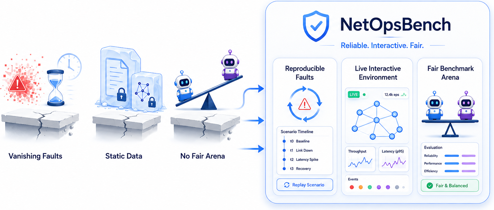
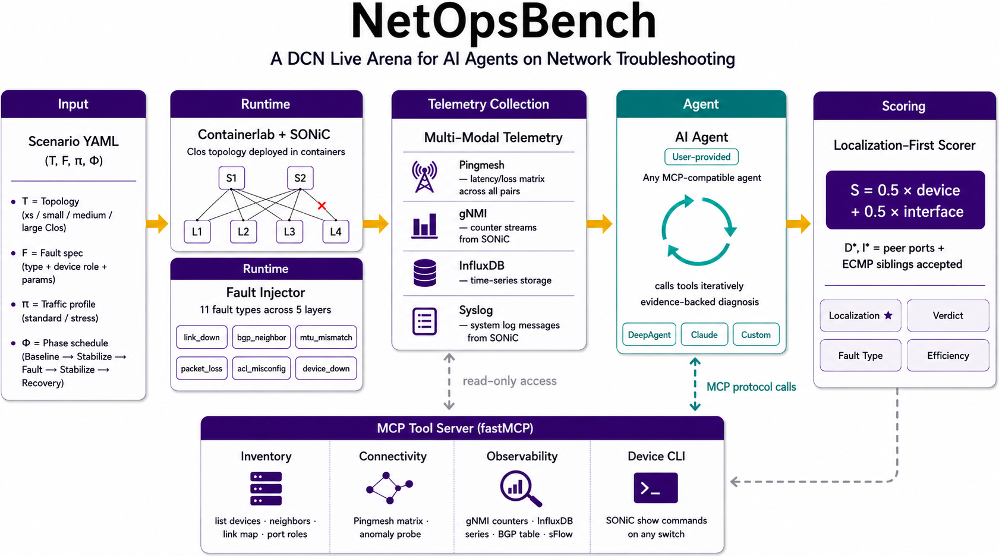
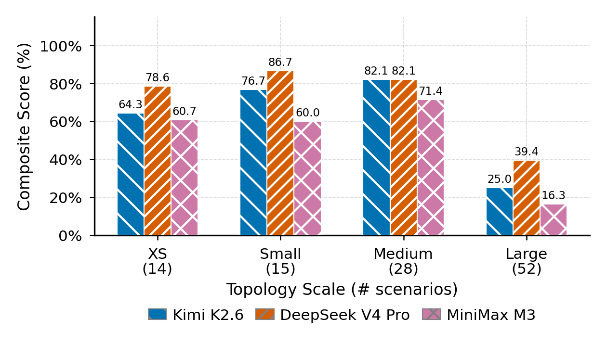

# NetOpsBench: Open Arena for NetOps in AI Infrastructure

<p align="center">
  <strong>Fair, reproducible benchmarks for agentic network troubleshooting.</strong>
</p>

<p align="center">
  <a href="https://github.com/NetX-lab/NetOpsBench/actions/workflows/test.yml"></a>
  <a href="https://github.com/NetX-lab/NetOpsBench/actions/workflows/docs-pages.yml"></a>
  <a href="https://www.python.org/downloads/"></a>
  <a href="LICENSE"></a>
  <a href="https://join.slack.com/t/netopsbench/shared_invite/zt-3zhhfangj-2U4dU_NSfCy1rcOM1dmuvQ"></a>
  <a href="https://applink.feishu.cn/client/chat/chatter/add_by_link?link_token=595v4390-2a51-4db0-baa4-811821b47448"></a>
</p>

<p align="center">
  <a href="https://netx-lab.github.io/NetOpsBench/">Website</a> ·
  <a href="https://netx-lab.github.io/NetOpsBench/docs/quickstart/">Quickstart</a> ·
  <a href="https://netx-lab.github.io/NetOpsBench/docs/build-your-agent/custom-agents/">Build Your Agent</a> ·
  <a href="https://huggingface.co/datasets/yyyyyt/netopsbench-trace">Trace Dataset</a>
</p>

NetOpsBench is an open benchmark arena for agentic network troubleshooting — run reproducible fault scenarios on live SONiC-VS / Containerlab topologies, plug in any troubleshooting agent, and score it across quality and efficiency dimensions.

## Why NetOpsBench

Developing and evaluating agentic root cause analysis methods for network troubleshooting remains challenging, with three core bottlenecks hindering further advancement:



| Gap | The problem | How NetOpsBench closes it |
|---|---|---|
| **No fair comparison** | Varied network topologies, fault sets, observability tools, and evaluation metrics hinder the comparison of agentic troubleshooting strategies across the research community. | NetOpsBench unifies fault scenarios, observability access and scoring rules to support agent comparison on a shared benchmark. |
| **Non-reproducible faults** | Real network incidents cannot be reliably reproduced or labeled with consistent ground truth, slowing iterative improvement and evaluation of troubleshooting agents. | Containerlab + SONiC-VS inject controlled, reproducible faults with stable labels, so every run is an identical, repeatable episode. |
| **Non-Interactive Environment** | Static topology snapshots and logs cannot provide live probing and telemetry signals required by agents for diagnostic work. | NetOpsBench offers an interactive environment for agents to operate within live networks, capturing real-time Pingmesh data, gNMI telemetry and switch CLI evidence during every episode. |


## Overview

NetOpsBench provides: (1) an interactive and realistic environment mimicking production networks, with common tracing and telemetry tooling; (2) comprehensive and reproducible benchmarks covering a wide range of faults and failures; (3) an extensible architecture with an open SDK to readily integrate with various agent paradigms and observability tools, allowing users to try out their own agentic workflows.

It is built for researchers and engineers who want to compare LLM-backed, symbolic, heuristic, or hybrid troubleshooting strategies on the same operational benchmark, not just on static logs or hand-written prompts.



## News

- **2026-05**: 🎉 **Initial Release** - NetOpsBench is now available as an open arena for agentic network troubleshooting.
  - Provide public SDK with `run_scenario()` and `run_suite()` APIs to launch live network environments from Python.
  - Equip native MCP tools of complete observability utilities and pre-configured SONiC-VS network covering XS, Small, Medium and Large scales.
  - Offer fault scenario generation scripts and an expanding repository of reproducible fault cases with standard ground truth labels.
  - A full-fledged benchmark evaluator that accesses detection accuracy and token utilization efficiency.

## Quick Start

> NetOpsBench runtime execution requires Linux because Containerlab depends on Linux networking primitives.

### Install and run via CLI

```bash
git clone https://github.com/NetX-lab/NetOpsBench.git
cd NetOpsBench

python -m venv .venv
source .venv/bin/activate
pip install -e ".[agent]"

netopsbench benchmark prepare --scales xs
export OPENAI_API_KEY=...
PYTHONPATH=. python examples/01_run_scenario.py --vendor openai
```

The first successful run produces a `BenchmarkReport` with case-level scores, timing, and artifact paths. For Docker, Containerlab, and runtime setup details, read [Quickstart](docs/content/docs/quickstart.mdx).

### Run a scenario from Python

```python
from examples.agents import MinimalDeepAgent
from netopsbench.sdk import NetOpsBench

scenario = "scenarios/generated/xs/generated_link_down_xs_001.yaml"

with NetOpsBench(workspace=".") as bench:
    agent = bench.agents.wrap(MinimalDeepAgent(vendor="openai"))
    run = bench.sessions.run_scenario(scenario=scenario, agent=agent)
    report = run.wait()

print(report.summary)
```

Scenario YAML files define the benchmark case: topology scale, traffic profile, fault type, target device, and interface-level ground truth when applicable. Use the [Python API Guide](docs/content/docs/build-your-agent/python-api-guide.mdx) for `run_scenario(...)`, `run_suite(...)`, and `workers=N`; see [Custom Troubleshooting Agents](docs/content/docs/build-your-agent/custom-agents.mdx) when you are ready to replace `MinimalDeepAgent` with your own strategy.

## Benchmark Results

NetOpsBench reports detection, fault type, device/interface localization, runtime, tool calls, and token usage so troubleshooting quality and operational cost can be compared together.



Read [Benchmark Methodology](docs/content/docs/run-benchmarks/methodology.mdx) for scoring definitions and [Benchmark Results](docs/content/docs/run-benchmarks/results.mdx) for an example completed suite.

Public agent trajectory artifacts are available in the [NetOpsBench Trace Dataset](https://huggingface.co/datasets/yyyyyt/netopsbench-trace), including Harbor/ATIF traces, run reports, and summary CSVs for reproducible analysis.

## Learn More

| Goal | Start here |
|---|---|
| Run one scenario | [Quickstart](docs/content/docs/quickstart.mdx) |
| Run scenarios, suites, and batches | [Running Benchmarks](docs/content/docs/run-benchmarks/run-scenario-vs-suite.mdx) |
| Plug in your own troubleshooting agent | [Custom Troubleshooting Agents](docs/content/docs/build-your-agent/custom-agents.mdx) |
| Use NetOpsBench from Python | [Python API Guide](docs/content/docs/build-your-agent/python-api-guide.mdx) |
| Interpret benchmark scores | [Benchmark Methodology](docs/content/docs/run-benchmarks/methodology.mdx) |
| Debug observability or runtime state | [Operations](docs/content/docs/debug-operate/observability.mdx) |
| Understand the benchmark loop | [System Overview](docs/content/docs/architecture/system-overview.mdx) |

## Community

- Global community: [NetOpsBench Slack](https://join.slack.com/t/netopsbench/shared_invite/zt-3zhhfangj-2U4dU_NSfCy1rcOM1dmuvQ)
- Chinese-language community: [NetOpsBench Feishu group](https://applink.feishu.cn/client/chat/chatter/add_by_link?link_token=595v4390-2a51-4db0-baa4-811821b47448)

## Contributing

Contributions are welcome for benchmark scenarios, fault types, SDK ergonomics, documentation, and evaluation workflows.

## License

NetOpsBench is released under the MIT License. See [LICENSE](LICENSE).

## Citation

If you use NetOpsBench in your research, please cite:

```bibtex
@software{netopsbench2026,
  author  = {Yang, Yitao and Xu, Hong},
  title   = {{NetOpsBench}: Open Arena for NetOps in AI Infrastructure},
  year    = {2026},
  url     = {https://github.com/netx-lab/NetOpsBench},
}
```
